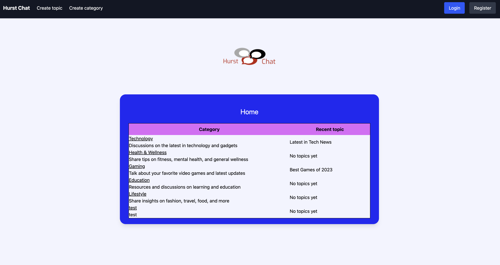

# Hurst Chat

This is a chat application designed for my A-Level Computer Science NEA. It allows users to create accounts, log in, and
send messages to each other. The project is built using React, Node, Express and PostgreSQL, with a focus on security
and user experience.

TypeScript monorepo containing:

- `apps/frontend`: Vite + React frontend
- `apps/backend`: Node + Express API
- `db`: PostgreSQL schema/seed SQL

## Features

- User registration and login
- Sending and receiving messages
- User profiles

## Project Structure

```
.
├── apps
│   ├── backend
│   └── frontend
├── db
├── images
├── docker-compose.yml
└── package.json
```

## Prerequisites

- Node.js 20+
- npm 10+
- PostgreSQL 17 (or Docker)

## Install

```bash
npm install
```

## Run Locally

Frontend:

```bash
npm run dev:frontend
```

Backend:

```bash
npm run dev:backend
```

## Build

```bash
npm run build
```

## Docker (Backend + Postgres)

```bash
docker compose up --build
```

## Notes

This project is in active cleanup/refactor state and is not production-ready yet.

## Screenshots

Homepage: 
